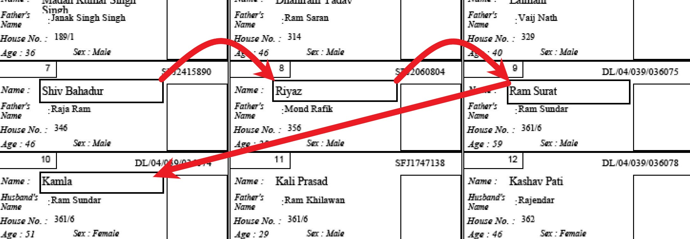

# ELECTORAL ROLL EXTRACTION USING OCR
# INTRO
Last year Election Commision of India made sure that electoral roll cannot be converted to editable format easily by making electoral data into an image format. But image data is not safe now when OCR technology is improving day by day. In this project I have used Tesseract 3(stable) and 4(latest) to fetch data of electoral roll and use strengths of both version to get maximum accuracy.

Tesseract 3, which is stable version till date can be used to whitelist characters, which tesseract 4, which is latest version till date,  lacks. Tesseract 4 on other hand have high accuracy on text data.

To fetch data I have used tesseract 3 for numerical and categorical values and tesseract 4 for names.

There were many ways to extract data from electoral roll. One of them would be to extract text of complete image at once and clean the data later. This method, although fast, it is very tedious to clean afterwords. Then I used the fact that in electoral roll all the information have set pattern and are uniformly divided to my advantage. 

There were 2 types of pattern in Electoral data in a ward.
1. Front Page
2. Electoral voters data

## 1. Front Page
Extracting data from front page was simple as all the data needed to be extracted were in one place. Information we extracted were
1. Vidhan Sabha
2. Part Number
3. Main Town
4. Polling Station name
5. Male count
6. Female count
7. Total

## 2. Electoral voters data
Extacting data from electoral voters data was relatively difficult because same type of data was available 30 times in a page. To do that 
made it hope data 3 times horizontally and 10 times horizontally. Information we extracted were
1. Name
2. Guardian Name
3. Guardian relation
4. Gender
5. Age

# IMAGE PREPROCESSING
## Please read [this](https://medium.freecodecamp.org/getting-started-with-tesseract-part-ii-f7f9a0899b3f) article to understand image preprocessing for OCR

# EXTRACTION
## Front Page
We crop part of image rectangularly and extract text of image. For example to extract data for female count we will use following code
```
image_to_string(cropped_im_fem,config='-c tessedit_char_whitelist=0123456789 --psm 6')
```
In this whitelist states that outcomes should come from 0123456789 only.
Here psm stands for [Page segmentation modes](https://github.com/tesseract-ocr/tesseract/wiki/Command-Line-Usage)
```
  0    Orientation and script detection (OSD) only.
  1    Automatic page segmentation with OSD.
  2    Automatic page segmentation, but no OSD, or OCR.
  3    Fully automatic page segmentation, but no OSD. (Default)
  4    Assume a single column of text of variable sizes.
  5    Assume a single uniform block of vertically aligned text.
  6    Assume a single uniform block of text.
  7    Treat the image as a single text line.
  8    Treat the image as a single word.
  9    Treat the image as a single word in a circle.
 10    Treat the image as a single character.
 11    Sparse text. Find as much text as possible in no particular order.
 12    Sparse text with OSD.
 13    Raw line. Treat the image as a single text line,
       bypassing hacks that are Tesseract-specific.
 ```
 Since we had single uniform block of text we used psm 6
 
## Electoral voters data
We will every process used above. Additionally we have to extract same data 30 times. We know they have equal distance. So will hop one by one till we reach end of the page. We will do that for every feature we are extracting. 
Notice that in below image that we extend the size of box to max on right, that is because we are not sure what will be the length of name.



### Time Management
Extracting data from electoral voters data is heavy and tiring process for us and computer. To break that tiring process I tried to break this process into different chunks.
Suppose we have 10,000 images to extract data from, we cannot data extract that data from our normal laptops and desktops within a day. To avoid that what I have done is broken this list of 10,000 images into group of small lists. For example I broke 10,000 into 500 lists. Now each list will have
```
10,000/500 = 20 images
```
I made sure that after extracting data from every 20 image our computer will save and export our data in csv format.

## SAMPLE OUTPUT

